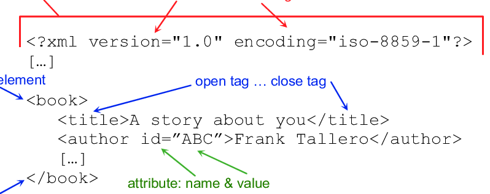

# Cuaderno lenguaje de marcas
## Tabla de contenidos
[Historia y evolución de los lenguajes de marcas](#Historia-y-evolución-de-los-lenguajes-de-marcas)

[Características de los lenguajes de marcas](#Características-de-los-lenguajes-de-marcas)

[XML: definición y características del metalenguaje](#xml-definici%C3%B3n-y-caracter%C3%ADsticas-del-metalenguaje)

# Qué es un lenguaje de marcas
Según Lamarca (2010) los lenguajes de marcas constituyen una serie de reglas 
que definen todo lo que forma parte de un documento digital a excepción del 
texto en sí mismo. 

Cabe destacar que en un lenguaje de marcas existen, por un lado, los datos que 
conforman el contenido de un documento, y por otro, los datos que le dan la 
estructura y formato mencionados anteriormente, en forma de etiquetas 
(Lamarca, 2010).

En el contexto de la programación web, el lenguaje de marcas se refiere a la forma de codificar un documento o página web. Es una manera de definir la estructura del texto o su presentación incorporando etiquetas o marcas que contienen información adicional. Su principal objetivo es clarificar la estructura de un documento y el contenido semántico del mismo. 

Muchas personas confunden los lenguajes de marcado, como también se les conoce, con los lenguajes de programación, pero no son lo mismo. El lenguaje de marcas, por ejemplo, no tiene funciones aritméticas o variables, como sí incluyen los lenguajes de programación.

De hecho, el lenguaje de marcado posee algunas características distintivas, como el uso de texto plano, de forma que cualquier persona puede leer y editar la información.

Además, es fácil acceder a su contenido a través de cualquier dispositivo y altamente flexible, ya que permite combinar otros lenguajes. También se trata de un lenguaje compacto en el que las etiquetas de marcas se unen con el contenido del mismo.

# Historia y evolución de los lenguajes de marcas

En los años 60 se planteó un problema que existía en el mundo de la informática: No había prácticamente ninguna compatibilidad entre sistemas operativos y programas.

Es a raíz de esta problemática que entre 1969 y 1970, un investigador de IBM, Charles Goldfarb contribuye al desarollo del lenguaje de marcas GML (*IBM Generalized Markup Language, por sus siglas en inglés*). No obstante, este lenguaje no estaba estandarizado, lo que conllevaba que únicamente la empresa propietaria del lenguaje sabía hacerlo funcionar correctamente.

En base a la necesidad generada por falta de un estándar, en 1986 se aprueba la norma ISO 8879 que define SGML (*Standard Generalized Markup Language, por sus siglas en inglés*). 

Se trata de un modelo abierto para la creación de documentación electrónica, que unifica la aplicación de los conceptos de anotación estructural de los documentos. No es un formato de almacenamiento ni un procesador de textos, sino un metalenguaje con el cual se pueden crear y definir diferentes lenguajes de anotación o marcas, con los cuales es posible procesar, gestionar y almacenar un texto; esto es lo que ocurre en el caso del HTML, utilizado para la descripción de documentos en web.

Básicamente, el SGML (Standard Generalized Markup Language) es un modelo internacional que permite estandarizar y definir formalmente un documento electrónico, independientemente del software, la aplicación o el sistema que se utilice.

Entre 1989 y 1991 se crea HTML a partir de SGML. Es un lenguaje fácil de usar y con un uso muy extendido.

Con el paso del tiempo, HTML va evolucionando en sus versiones hasta llegar a  la actual: HTML 5.

En 1998 surge como estándar del W3C el lenguaje de marcas XML. Se trata de un lenguaje que permite definir y almacenar datos de forma compartible. Es un lenguaje sencillo de comprender y está diseñado para ser usado en cualquier alfabeto.

Por último, destacar que más tarde se crearía el lenague XHTML, que se utiliza pra la creación de páginas webs, y usa reglas de sintaxis XML, que son más estrictas que HTML. XHTML tiene como objetivo proporcionar consistencia de representación entre los navegadores. 

# Características de los lenguajes de marcas

1. Un lenguaje de marcado utiliza etiquetas para anotar textos. Las etiquetas son palabras o caracteres especiales que indican cuándo debe aplicarse un formato.

2. Las etiquetas van en pares, con una etiqueta de apertura y otra de cierre. Por ejemplo, en HTML, la etiqueta de negrita se escribe así: < b > y < /b >.

3. El texto que va entre las etiquetas de apertura y cierre se verá afectado por el formato. En el caso de la etiqueta negrita, el documento mostraría el texto en negrita.

4. Los lenguajes de marcas son fáciles de leer. En general, cualquiera debería ser capaz de leer y entender un lenguaje de marcas, aunque no sepa escribirlo.

5. Los lenguajes de marcas también tienen una sintaxis, o conjunto de reglas, que definen cómo utilizar las etiquetas. Esta sintaxis permite crear documentos coherentes y estructurados.

* Independencia. Su uso no debe depender de ninguna plataforma Hardware ni sistema Software concreto.

* Almacenados en texto plano. El documento está compuesto únicamente por caracteres de texto.

* Flexibilidad. Los lenguajes de marcas deben ser lo suficientemente flexibles para poder utilizarse en diferentes contexto.

* Compactibilidad. Las marcas y el contenido se encuentran en el mismo documento.

* Facilidad de procesamiento. El formato debe ser diseñado de tal manera que el procesamiento automático sea sencillo.

## XML
### Las características de XML son las siguientes: 

1. XML Se centra prioriza la información a la apariencia: Una de las razones por las que XML es popular es porque prioriza la información a la presentación de la misma.

2. Intercambio de datos fácil y eficaz: Como XML es independiente del software y el hardware, es más fácil compartir datos entre distintos sistemas con diferente configuración de hardware y software. Cualquier sistema con cualquier lenguaje de programación puede leer y procesar un documento XML.

3. Compatibilidad con HTML: Es mucho más fácil leer los datos de XML y mostrarlos en una GUI (interfaz gráfica de usuario, por sus siglas en inglés) utilizando el lenguaje de marcado HTML.

4. Permite la validación XML: Un documento XML puede validarse mediante DTD o esquema XML. Esto garantiza que el documento XML es sintácticamente correcto y evita cualquier problema que pueda surgir debido a un XML incorrecto.

5. Se adapta a los avances tecnológicos: La razón por la que XML es tan popular y se utiliza desde hace tanto tiempo es que puede adaptarse a las nuevas tecnologías al ser independiente de plataforma.

6. XML admite Unicode: XML admite Unicode, lo que le permite comunicar casi cualquier información en cualquier lenguaje humano escrito.

### Ejemplo de XML:

## HTML
### Las características de HTML son las siguientes:

Es fácil de aprender y de usar.

Es independiente de la plataforma.

Se pueden añadir imágenes, vídeos y audio a una página web.

Se puede añadir hipertexto al texto.

### Ventajas de HTML:

HTML se utiliza para crear sitios web.

Es compatible con todos los navegadores.

Puede integrarse con otros lenguajes como CSS, JavaScript, etc.

### Deventajas de HTML: 

HTML sólo puede crear páginas web estáticas. Para páginas dinámicas, hay que utilizar otros lenguajes.

Hay que escribir una gran cantidad de código para crear una simple página web.

La seguridad no es brillante.

## JSON

### Introducción sobre JSON:

JSON es un formato ligero de intercambio de datos de texto más que un lenguaje de programación. Su sintaxis admite cadenas, valores, booleanos, nulos, así como objetos y matrices basados en él.

He aquí algunos datos sobre JSON:

Douglas Crockford inventó el formato JSON.

JSON es un formato ligero de intercambio de datos de texto.

JSON no es un lenguaje de programación.

XML es una alternativa a JSON. Sin embargo, los objetos JSON tienen varias ventajas frente a XML.

El tipo de medio JSON es application/json y la extensión de archivo es .json.

JSON se ha extendido desde el lenguaje de scripting JavaScript.

JSON utiliza la sintaxis de JavaScript para describir objetos de datos, pero aún así, el lenguaje JSON es independiente de la plataforma. El analizador JSON y las bibliotecas JSON están disponibles en muchos lenguajes de programación diferentes.

### Características de JSON:

JSON es escalable. Al ser independiente del lenguaje, funciona con la mayoría de los lenguajes de programación modernos.

JSON es ligero.

JSON es fácil de leer y escribir.

JSON es un formato de intercambio de datos basado en texto y legible por humanos.

### ¿Qué se puede hacer con JSON?

JSON se utiliza principalmente para transmitir datos entre servidores y aplicaciones web.

Actualmente, las bases de datos NoSQL también utilizan JSON para almacenar información.

### Ejemplo de JSON:

## YAML
### ¿Qué es YAML?

YAML es un lenguaje de serialización de datos. Cuando apareció en 2001, YAML significaba "Yet Another Markup Language" (otro lenguaje de marcado). El acrónimo se cambió más tarde a "YAML Ain't Markup Language" (YAML no es un lenguaje de marcado) para enfatizar que el lenguaje está pensado para datos y no para documentos.

No es un lenguaje de programación en el verdadero sentido de la palabra. Los archivos YAML almacenan información, por lo que no incluyen acciones ni decisiones.

A diferencia de XML o JSON, YAML presenta los datos de forma que un humano pueda leerlos fácilmente. La sintaxis simple no afecta a las capacidades del lenguaje. Cualquier dato o estructura que se añada a un archivo XML o JSON también puede almacenarse en YAML.

Además de código legible por humanos, YAML también presenta:

Portabilidad de datos entre lenguajes

Un modelo de datos coherente

Procesamiento en un solo paso

Facilidad de implementación y uso

### Características de YAML
YAML tiene varias características que lo convierten en una excelente opción para el formateo de datos.

1. Compatibilidad con varios documentos

Los usuarios pueden añadir varios documentos a un único archivo YAML Separando los distintos documentos con tres guiones (---).

Tres puntos ("...") marcan el final de un documento sin iniciar uno nuevo.

2. Comentarios incorporados

YAML permite a los usuarios añadir comentarios a su código. Los comentarios en YAML empiezan con el símbolo # y no tienen por qué estar en una línea aparte.

3. Sintaxis Limpia

Al igual que Python, YAML utiliza sangrías para mostrar los niveles y la estructura de los datos. No hay símbolos de formato habituales, como llaves, corchetes, etiquetas de cierre o comillas. La sintaxis es limpia y fácil de leer.

La sintaxis limpia es la razón por la que varias herramientas populares se basan en YAML, como Ansible, Kubernetes y OpenStack.

4. Sin tabulaciones

YAML no permite tabulaciones. Los espacios son la única forma de lograr el sangrado.

Es una buena práctica mostrar caracteres de espacio en blanco en su editor de texto para evitar el uso accidental de tabuladores.

5. Retroalimentación precisa 

La retroalimentación de YAML se refiere a líneas específicas del archivo. Puedes encontrar y corregir errores rápidamente si sabes dónde buscar.

6. Soporte de estructuras complejas

YAML ofrece la posibilidad de referenciar otros objetos de datos. Con la referenciación, puede escribir datos recursivos en el archivo YAML y construir estructuras de datos avanzadas.

7. Tipos de datos explícitos con etiquetas

YAML detecta automáticamente el tipo de datos, pero los usuarios son libres de especificar el tipo que necesitan. Para especificar el tipo de datos, se incluye un símbolo "!!".

8. Sin comandos ejecutables

YAML es un formato de representación de datos. No existen comandos ejecutables, lo que hace que el lenguaje sea muy seguro a la hora de intercambiar archivos con terceros.

Si un usuario desea añadir un comando ejecutable, YAML debe integrarse con otros lenguajes. Añadiendo analizadores sintácticos de Perl, por ejemplo, para permitir la ejecución de código Perl.

### Ejemplo de YAML:

# XML: definición y características del metalenguaje
### Definición de XML
XML es un término que proviene de eXtensible Markup Language (“Lenguaje de Marcas Extensible”). Se trata de un metalenguaje (un lenguaje que se utiliza para decir algo acerca de otro) extensible de etiquetas que fue desarrollado por el Word Wide Web Consortium (W3C), una sociedad mercantil internacional que elabora recomendaciones para la World Wide Web.

El XML es una adaptación del SGML (Standard Generalized Markup Language), un lenguaje que permite la organización y el etiquetado de documentos. Esto quiere decir que el XML no es un lenguaje en sí mismo, sino un sistema que permite definir lenguajes de acuerdo a las necesidades. El XHTML, el MathML y el SVG son algunos de los lenguajes que el XML tiene la capacidad de definir.

Las bases de datos, los documentos de texto, las hojas de cálculo y las páginas web son algunos de los campos de aplicación del XML. El metalenguaje aparece como un estándar que estructura el intercambio de información entre las diferentes plataformas.

### Las características de XML están expuestas en el apartado correspondiente
### Prólogo
Esta línea se denomina prólogo:

El prólogo XML es opcional. Si existe, debe figurar en primer lugar en el documento.

Los documentos XML pueden contener caracteres internacionales, como el øæå noruego o el êèé francés.

Para evitar errores, se debe especificar la codificación utilizada o guardar sus archivos XML como UTF-8.

UTF-8 es la codificación de caracteres por defecto para los documentos XML.

### Etiquetas
Todos los elementos XML deben tener una etiqueta de cierre

En XML, es ilegal omitir la etiqueta de cierre. Todos los elementos deben tener una etiqueta de cierre

Las etiquetas XML distinguen entre mayúsculas y minúsculas.

Las etiquetas de apertura y cierre deben escribirse con las mismas mayúsculas y minúsculas.

Las "etiquetas de apertura y cierre" suelen denominarse "etiquetas de inicio y fin".Se puede utilizar lo que prefiera. Es exactamente lo mismo.

### Atributos
Los valores de los atributos XML siempre deben entrecomillarse

Los elementos XML pueden tener atributos en pares nombre/valor, igual que en HTML.

En XML, los valores de los atributos deben ir siempre entre comillas.

### Ejemplos en XML

### Prólogo XML 

### Etiquetas

### Atributos

## Referencias

* [Artículo universidad Europea](https://universidadeuropea.com/blog/que-es-lenguaje-marca/)
* [UOC sobre SGML](https://cv.uoc.edu/UOC/a/moduls/90/90_225/web/main/m1/v4_1.html#:~:text=B%C3%A1sicamente%2C%20el%20SGML%20Standard%20Generalized,el%20sistema%20que%20se%20utilice.)
* [Artículo sobre Lenguajes de marcas](https://gsitic.wordpress.com/2018/01/06/bii9-lenguajes-de-marca-o-etiqueta-caracteristicas-y-funcionalidades-sgml-html-xml-y-sus-derivaciones-lenguajes-de-script/)
* [Dpto. Informática Universidad de Burgos - XML](https://www.infor.uva.es/~jvegas/cursos/web/xml/ixml/ixml.html)
* [XML](https://beginnersbook.com/2018/10/xml-features/)
*[Definición XML](https://definicion.de/xml/)
*[ Reglas/Syntax de XML](https://www.w3schools.com/xml/xml_syntax.asp)
* [W3C JSON](https://www.w3schools.in/json/intro)
* [Sobre JSON](https://www.json.org/json-es.html)
* [Diferencias entre Yaml y JSON](https://aws.amazon.com/es/compare/the-difference-between-yaml-and-json/)
* [What is YAML](https://phoenixnap.com/blog/what-is-yaml-with-examples)
## Enlaces de interés
* [W3C](https://www.w3.org/)
* [github](https://github.com/) 
* [Markdown](https://markdown.es/) 
* [Google Académico](https://scholar.google.es/schhp?hl=es)

